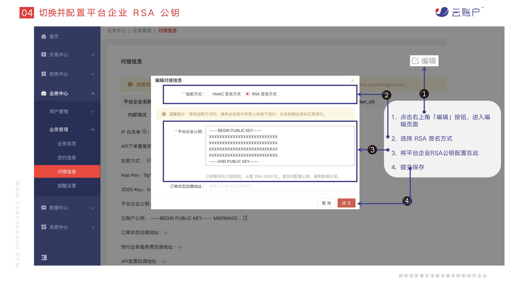

# 云账户 SDK For Java

## 功能概述

### 简介
- 本 SDK 适用于 Java 编程语言，可调用《云账户综合服务平台API技术对接文档》所有接口。
- 由于使用 SDK 时需要配置信息，请务必注意不要将配置信息配置在源码中，因为配置信息的保密等级往往比源码高得多，将会增加配置信息泄露的风险。推荐将配置信息储存在专用的配置文件中，将配置文件通过安全的流程分发到服务器的安全储存区域上，仅供自己的应用运行时读取。
- SDK 已经对加签验签逻辑做了封装，使用 SDK 时传入相应参数内容可直接通过 SDK 自动进行加解密、加验签。

### 环境要求

#### maven依赖
配置依赖请参考：

```
https://search.maven.org/artifact/com.yunzhanghu.openapi/sdk/1.1-RELEASE/jar
```
如有特殊需求需要源码，请联系云账户技术支持

#### 兼容说明
- JDK：1.8 及以上

### 获取配置

#### 获取 dealer_id、broker_id、3Des Key、App Key       

  根据开户邮件中的账号登录云账户综合服务平台：业务中心->业务管理->对接信息
  


#### 配置平台企业公钥

##### 生成秘钥

方式一：使用 OpenSSL 生成 RSA 公私钥

```
① ⽣成私钥 private_key.pem

Openssl-> genrsa -out private_key.pem 2048 # 建议密钥⻓度⾄少为2048

【Java 开发者需要将私钥转换成 PKCS8 格式，非 Java 跳过本步骤】OpenSSL-> pkcs8 -topk8 -inform PEM -in private_key.pem -outform PEM -nocrypt -out private_key_pkcs8.pem

② ⽣成公钥⽂件 pubkey.pem

Openssl-> rsa -in private_key.pem -pubout -out pubkey.pem

```

方式二：使用工具生成

```
请联系云账户技术支持获取 RSA 密钥生成工具
```

##### 上传平台企业公钥

登录云账户综合服务平台，在业务中心->业务管理->对接信息，点击页面右上角的编辑，配置平台企业公钥。



